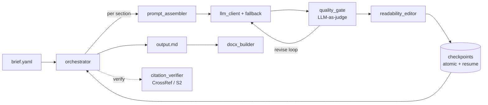

# llm-longdoc-pipeline


A reliable orchestration engine for **multi-step LLM document generation**. It
turns a short brief into a long, section-structured document, and it is built
to survive real-world failure: a killed process resumes from the last
checkpoint without repeating work, weak sections are caught by a judge before
they ship, and citations are verified against public bibliographic APIs.

> The reliability patterns here come from a production system the author built
> and operated. This repository is the extracted, domain-neutral engineering
> core - runnable end to end on a deterministic mock, no API key required.

## Why it is more than a for-loop over an LLM

- **🧩 Provider-agnostic LLM layer.** One `complete(messages) -> str` contract;
  `FallbackClient` tries providers in order so one outage degrades gracefully
  instead of failing the run. Keys come from the environment - zero secrets in
  code. ([`llm_client.py`](pipeline/llm_client.py))
- **⚖️ LLM-as-judge quality gate.** Every section is scored (`READY` /
  `NEEDS_FIXES`) and revised up to a bound before acceptance; a malformed judge
  reply fails open so generation never deadlocks. ([`quality_gate.py`](pipeline/quality_gate.py))
- **🔗 Citation grounding.** Cited sources are checked for existence against
  CrossRef + Semantic Scholar (fuzzy title/author/year match) to catch
  hallucinated references. ([`citation_verifier.py`](pipeline/citation_verifier.py))
- **🛟 Crash-safe checkpoints + auto-resume.** Atomic `temp+rename` writes,
  `fcntl` locks, rotating backups and auto-repair on corruption; a single
  atomic write advances substep status and `last_step` together, so resume
  never re-runs a completed step. ([`checkpoints.py`](pipeline/checkpoints.py))

## Architecture



Full design decisions and trade-offs: [`docs/architecture.md`](docs/architecture.md)
and the ADR log in [`docs/decisions/`](docs/decisions/).

## Quickstart (no key, no network)

```bash
pip install -e ".[docx,yaml]"
python -m pipeline examples/report_from_brief/brief.yaml --out out
# -> out/output.md, out/output.docx  (generated on the deterministic mock backend)
```

Point it at a real provider by setting `LLM_PROVIDERS` (comma-separated,
highest priority first) and the matching `*_BASE_URL` / `*_MODEL` / `*_API_KEY`
env vars for each OpenAI-compatible endpoint.

## Crash-resume, demonstrated

[`examples/crash_resume/demo.log`](examples/crash_resume/demo.log) shows a
worker killed mid-run, then restarted: already-checkpointed sections are not
regenerated and the document completes.

## Development

```bash
pip install -e ".[dev,docx,yaml]"
ruff check pipeline tests
mypy pipeline
pytest -q            # 22 tests: concurrency, crash-recovery, idempotency, judge, citation
```

## License

MIT - see [LICENSE](LICENSE).
