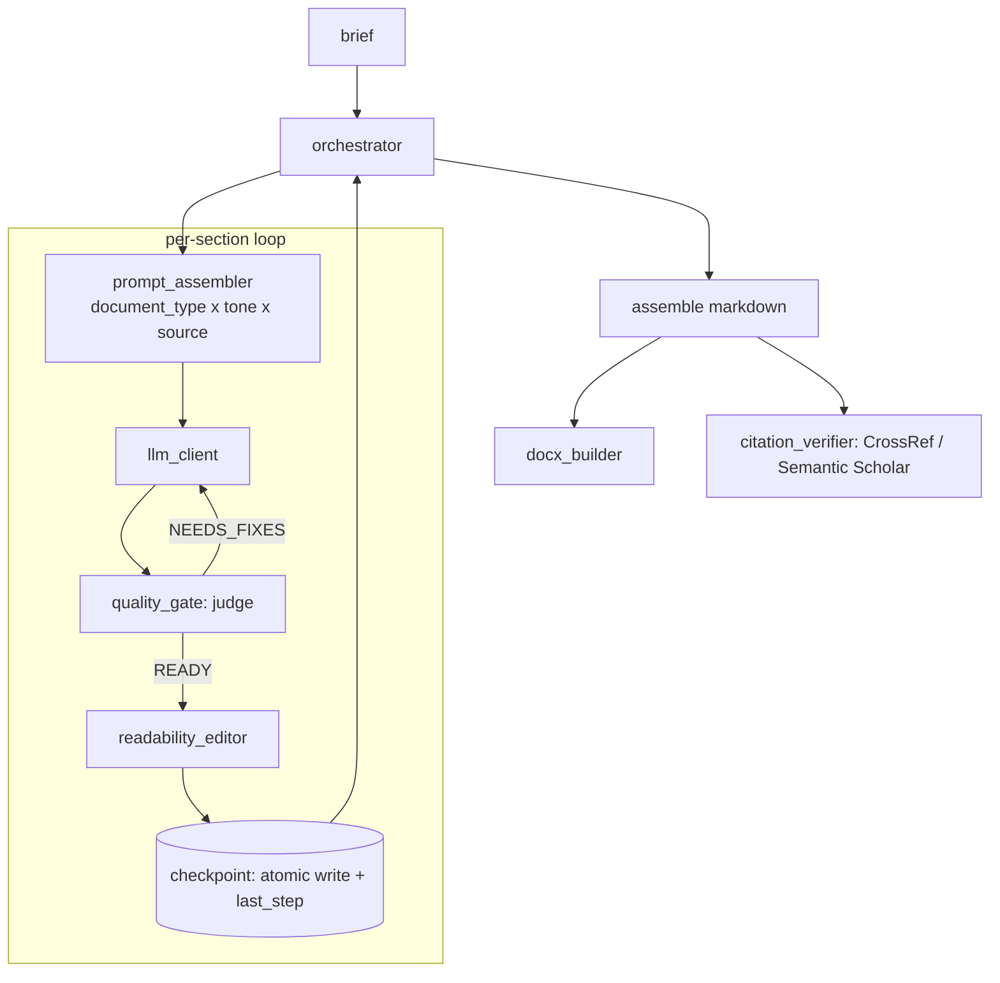

# Architecture

## What this engine does

It generates a long, section-structured document from a short brief, section by
section, and treats the LLM as an unreliable dependency: outputs are judged and
revised, calls are checkpointed so a crash is recoverable, and citations are
verified. The core is deliberately domain-neutral (reports, briefs, specs); the
same shape drives any long structured document.

## Pipeline

## The three properties that matter

1. **Idempotent auto-resume.** Each accepted section is checkpointed with a
   single atomic write that advances both `substeps[x]=done` and `last_step`.
   On restart the orchestrator skips sections already in state, so a killed
   worker never re-runs a non-idempotent LLM call. The failure mode this
   prevents (partial progress lost, or a step repeated with side effects) is
   the most expensive one in a long, paid, multi-call generation.

2. **Quality gate as a bounded loop.** A separate judge call classifies each
   draft `READY` / `NEEDS_FIXES` and drives up to N revisions. It fails open on
   a malformed verdict - the judge improves output, it must never be able to
   deadlock generation.

3. **Consistency carry-over.** A running summary of prior sections is injected
   into each new section's prompt, so a long document stays coherent without
   resending the whole thing every call.

## Design decisions and trade-offs

See [`decisions/`](decisions/) for the ADR log. Highlights:

- **File-based checkpoint store over a database.** Atomic `temp+rename` on one
  filesystem plus `fcntl` locks gives crash-safety and concurrent-writer safety
  with zero infra. Trade-off: single-host; a distributed run would need a shared
  store. For per-job state this is the right default.
- **Money and counters in integer units, never floats.** (Applies to the
  financial subsystems described below.) Avoids rounding drift in balances.
- **Composable prompts over per-type mega-prompts.** Adding a document type is a
  data row, not a new code path - keeps prompts diff-able and testable.
- **Mock LLM as a first-class backend.** The full pipeline runs deterministically
  in CI with no key and no spend; tests exercise real control flow, not stubs.

## Engineering patterns from the broader system

The reliability core above was extracted from a larger production service. A few
adjacent patterns are not included as code here (they are tied to product and
user data), but are worth naming because they are part of the same engineering
work and use the same discipline:

- **Idempotent webhooks.** A deduplicated, allowlisted webhook handler with
  idempotency keyed on the provider event id, so retried deliveries never apply
  an effect twice.
- **Atomic ledger math.** Balance and counter updates in integer minor units
  with atomic adjustments - no floating-point rounding drift.
- **Hardened admin auth.** JWT + JTI sessions, time-boxed access, an audit log,
  brute-force protection and timing-equalized comparisons.
- **Operational reliability.** Background workers with heartbeat/watchdog and
  requeue, graceful shutdown, and a data-handling pipeline with redaction and
  encryption at rest.

These are named to show engineering breadth; the open code here is the neutral,
reusable reliability and LLM-orchestration core.
